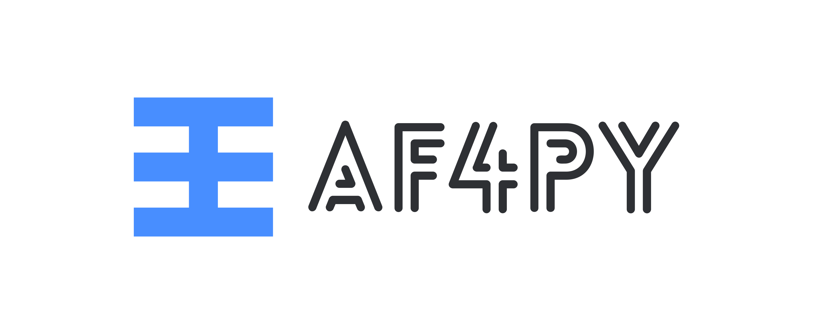
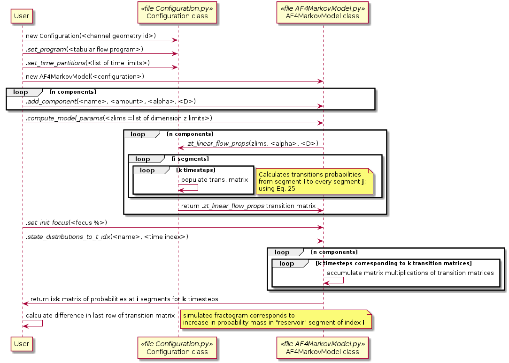

<div style="text-align:center">

</div>

AF4Py is a package for modeling sample separation using Asymmetrical flow-field flow fractionation based on sample component diffusion coefficient (*D*). The model uses non-equilibrium theory to numerically estimate sample separation in the channel with the use of [TensorFlow](http://www.tensorflow.org). 

The project was created as part of my master's thesis project and in addition to being able to simulate fractograms features non-standard methods.
For details about using the package feel free to get in touch with me (Oscar Silva) via email to the address given in the license file.

## What does AF4Py do?

AF4Py allows predicting fractograms from a tabular input of sample components, for a system wtih provided flow program and channel dimensions. Non-equilibrium band-spreading and sample relaxation are the band-spreading phenomena accounted for.

The prediction is obtained numerically by solving ODE for non-equilibrium elution using Euler summation for each of the sample components. This formulation allows computing numerical solutions for separation programs which are analytically intractable.

AF4Py uses [TensorFlow 2.0+](http://www.tensorflow.org) for running computations, which allows fast execution on GPUs, and uses Python ≥ 3.6.

## Dependencies for AF4Py 
```bash
pip install -r requirements.txt
```
## Usage
The diagram below describes a typical workflow and necesary commands to obtain a simulated fractogram.

<div style="text-align:center">

</div>
